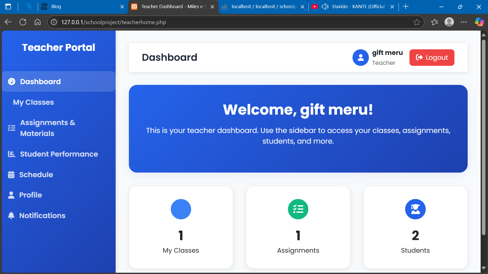
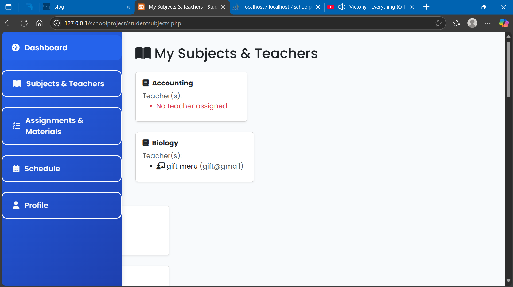

# 🎓 E-Learning Platform – School Project

This is a web-based **E-Learning Platform** designed as part of a school project for the course *Information Systems and Technology*. 
The platform allows students to register, log in, access course materials, and interact with uploaded resources. 
Admins can upload and manage course documents, announcements, and user roles.

---

## 📚 Features

### 👨‍🏫 For Students

* Register and log in securely
* View available courses and materials
* Download documents (PDFs, DOCs, etc.)
* View announcements or messages from instructors

### 👩‍🏫 For Admin/Instructor

* Admin login panel
* Upload and manage course documents
* Post announcements and updates
* Manage user accounts (students)

---

## 🛠️ Technologies Used

* **Frontend**: HTML5, CSS3, JavaScript
* **Backend**: PHP 8+
* **Database**: MySQL
* **Development Environment**: XAMPP / Laragon / Localhost
* **Editor**: Sublime Text / Visual Studio Code

---

## 🖼️ Screenshots

Below are some screenshots of the platform:


*Student Dashboard - Overview*


*Student Assignments Page*


*Student Subjects List*


*Student Profile Page*


*Student Notifications*


*Teacher Dashboard - Overview*


*Teacher Classes Page*


*Teacher Assignments Management*


*Teacher Notifications*


*Teacher Profile Page*


*Admin Dashboard*


*Admin User Management*

---

## 📁 Folder Structure

```
```
